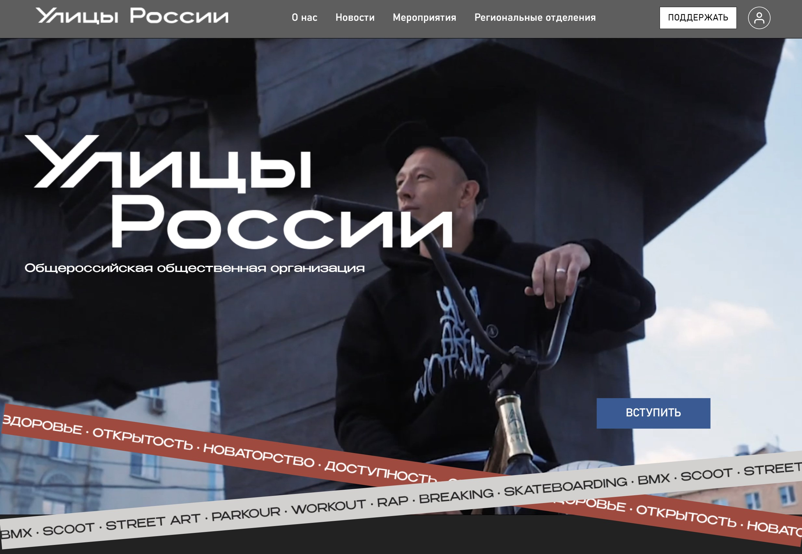
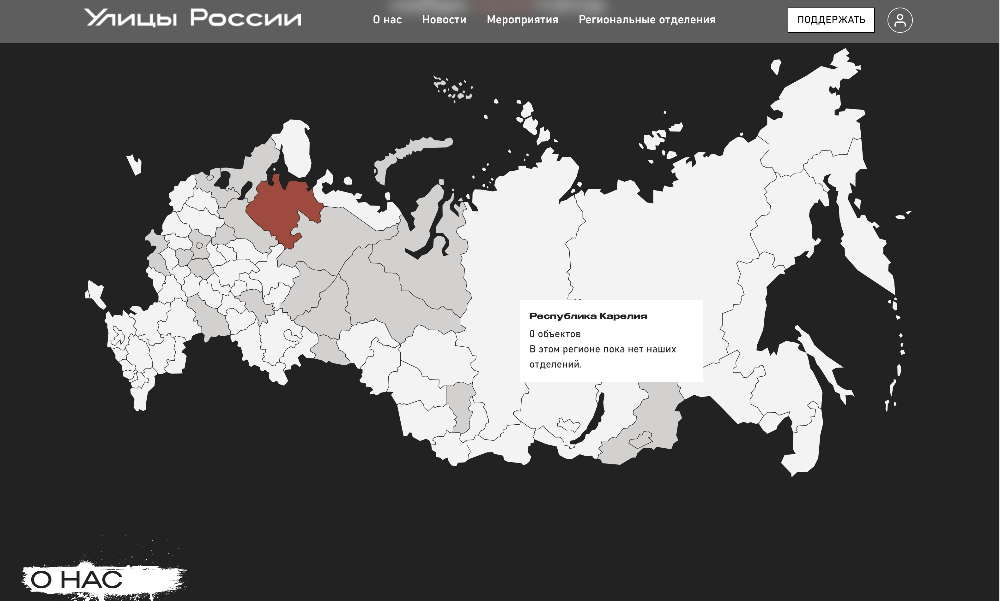
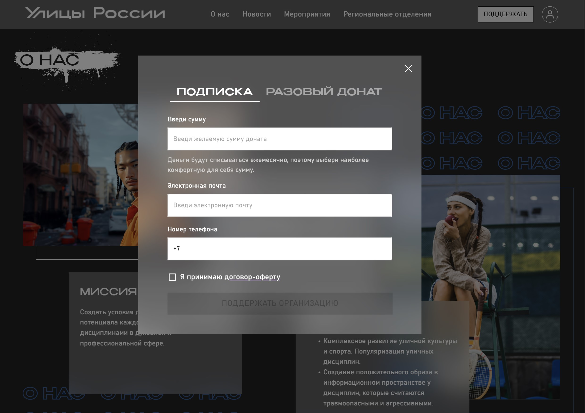
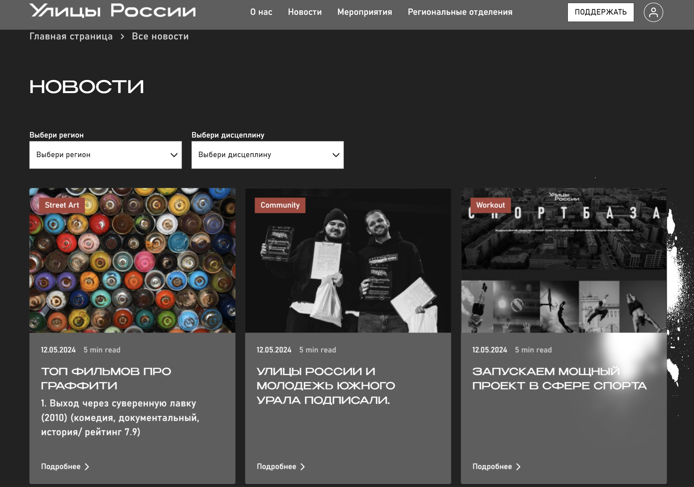
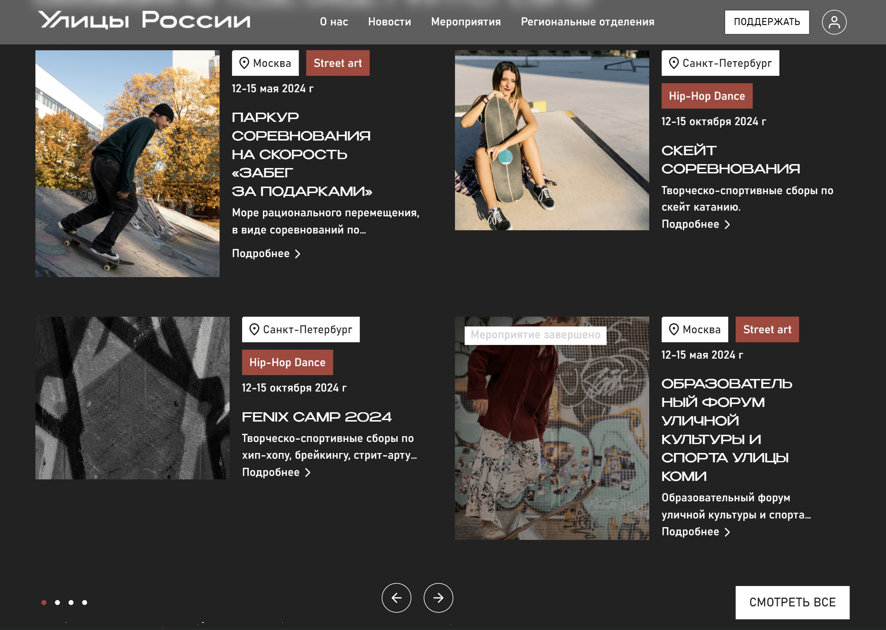
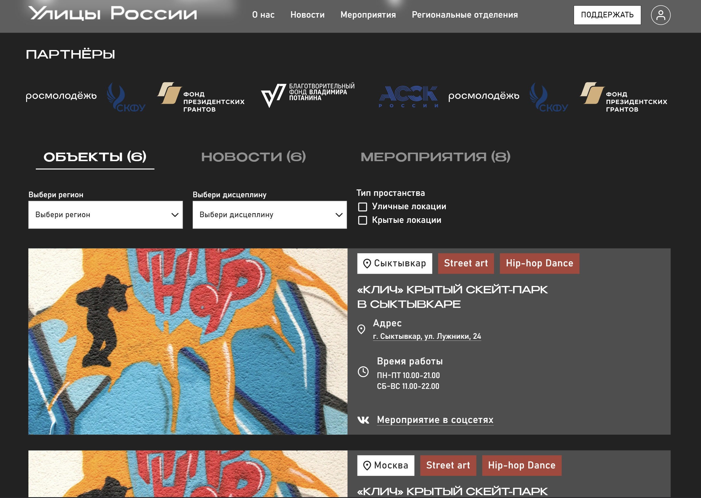
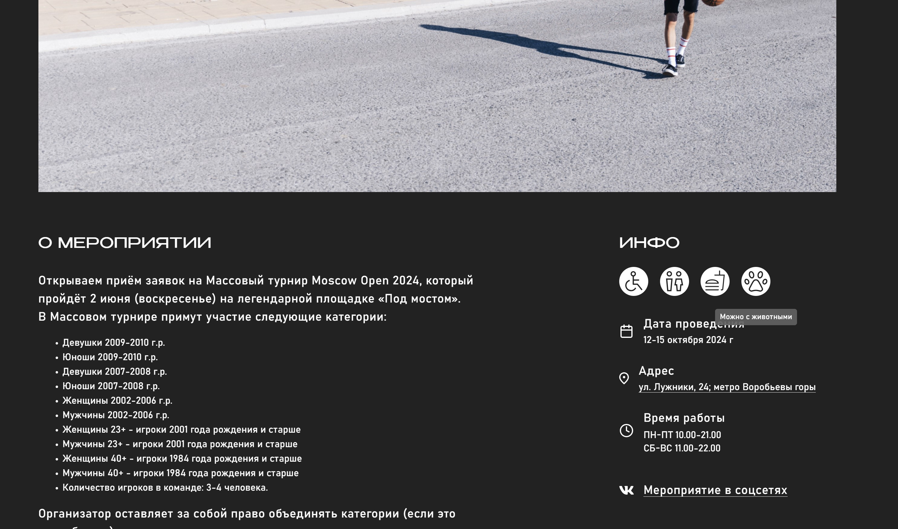
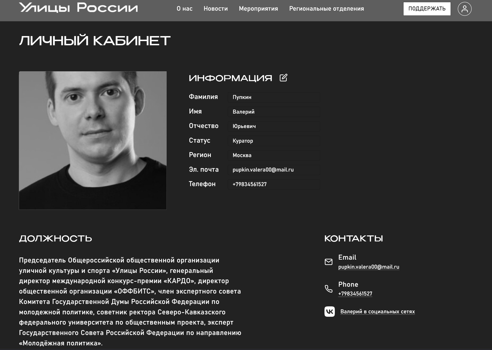
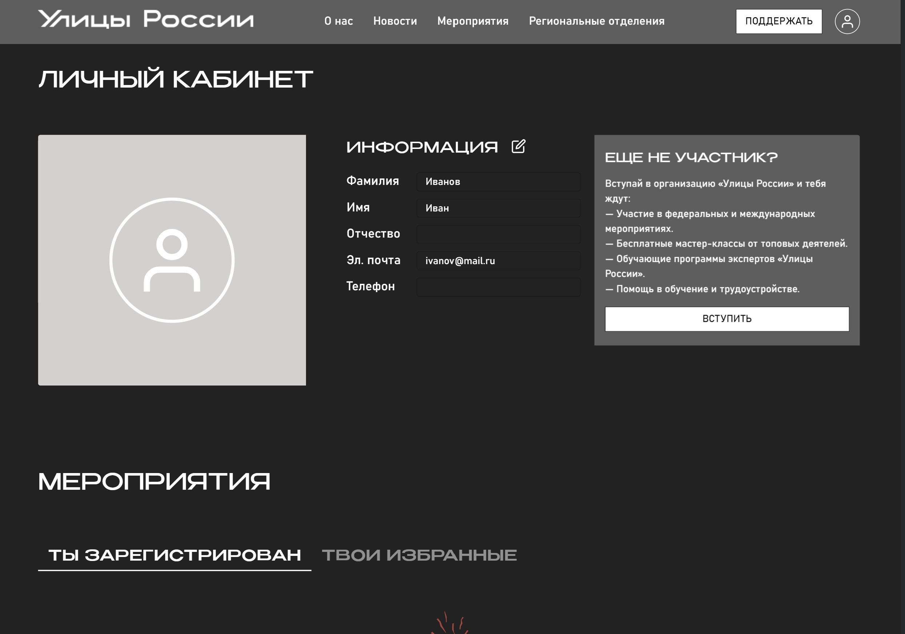

# Frontend for Street Russia

### О проекте
События и мероприятия уличных дисциплин по всем направлениям

### Опубликованное приложение
**[Ссылка на сайт](https://street-russia.vercel.app/)**


### Команда проекта

---

- [Ольга Панкрашина](https://github.com/Olyaolya13) tg: [@olyaolya2713](https://t.me/olyaolya2713)
- [Мария Ионова](https://github.com/Plugopanka) tg: [@plugopanka](https://t.me/plugopanka)

---

### Запуск приложения в dev mode

```javascript
клонируйте себе репозитори: git@github.com:street-russia-hackaton/frontend.git

переходите в папку проекта: cd frontend

установите зависимости: npm ci

запустите проект: npm run dev


```

### Запуск приложения в production mode
```javascript
npm run build
```

### Стек технологий

* HTML 5
* SCSS modules
* TypeScript
* React 18
* Redux Toolkit

### Сторонние библиотеки
- [Vite.js](https://vitejs.dev/)
- [Material UI](https://mui.com/)

### Ключевые точки для media queries max-width (1440px)

### Скриншоты

##### Главная станица


##### Карта с наведением и переключением по клику на субьект


##### Попап разовый донат


##### Страница О нас


##### Страница Новости



##### Страница Мероприятия



##### Страница Региональные отделения (объекты)


##### Дисциплины (клик по карточке)


##### Наведение на иконки 


##### Личный кабинет куратора


##### Личный кабинет юзера


